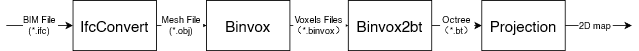
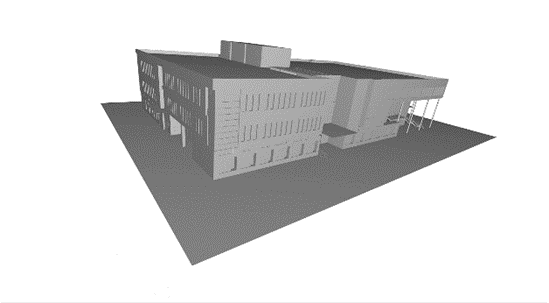
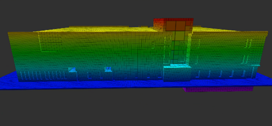
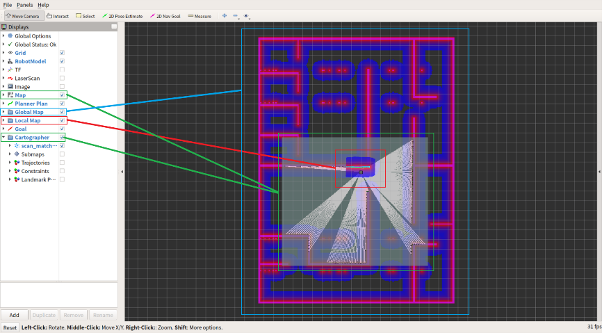
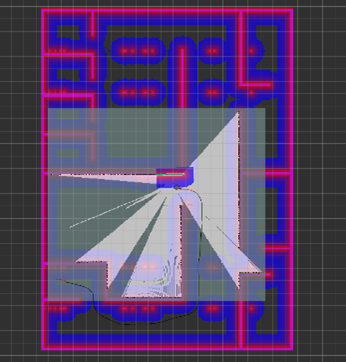

## Overview
This research uses Building Information Modeling(BIM) information in 2D Simultaneous Localization and Mapping(SLAM). In this project, the robot uses the information from BIM to generate a 2D map as prior knowledge of the building. Then the mobile robot uses this global map for initial localization and path planning, which can be a coverage path for map updating or a path to a target position. Besides, the mobile robot can update this prior map based on its following exploration. In conclusion, the advantage of this method is that it can help the robot reach its desired target without generating a map first. Instead, the robot can reach the desired position based on prior knowledge and update the map while moving.

The SLAM approach used in this project is based on Cartographer, and the method is tested in simulation in Gazebo with some random obstacles. All the work was done by myself. 

## Abstract
Construction robots don’t have the global information of the building unless they are allowed to build a map by SLAM in advance, which is time-consuming and prevents construction robots from making global plan for the task. At the same time, Building Information Modeling (BIM) is a digitalization and standardization of the building information. With the existing of BIM, the building interior in construction scenes is actually semi-unknown instead of totally unknown. In this research, we proposed a pipeline to transform the BIM to a 2D ideal map. Then, we combined the 2D ideal map and SLAM together for robot navigation. By using this ideal 2D map as the initial global map of the robot, the robot can obtain global information about the interior of the building, thus saving the time and inhance the efficiency.

## Piepline
This figure shows the pipline of data transformation.

This figure shows the building in the form of obj.

This figure shows the building in the form of Octree.

## Simulation
This figure shows different map in SLAM.

As shown in this figure, although our robot was new in the environment, it had the global information about the building according to the global costmap, which is generated from the 2D ideal map by the layered costmap structure.
The largest box shows the global costmap, and the second large box shows the information from the sensor. And the smallest box shows the local costmap.

This figure shows that the robot can generate a right path to the target although the sensor doesn’t have any information around the target point.

This figureshows that the robot can change its local path according to the local cost map, to avoid the crush between itself and the obstacles. 

This figure shows that the robot can arrive any target point on this specific floor in the building.

## Conclusion
In this paper, we proposed a pipeline to transform the BIM to a 2D ideal map, and then we used the 2D ideal to navigate the robot thus saving the time for building a map by SLAM in construction scenes. In the future, we will try to use more semantic information and lifecycle information in BIM to help robot finish its task.

<!--more-->
